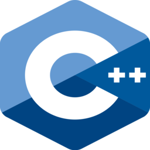

# C++-Programming

# Dare supporto/aiuto

Questi progetti spiegano molto chiaramente alcune delle basi di programmazione C++ e brevemente copre tutti gli argomenti principali utili per principianti. Questi progetti sono creati per aiutare la pratica e la comprensione dell'argomento per i principianti. Se vuoi contribuire in questo "progetto di svago" invia un Issue quando presente un errore di sintatti, o un Pull Request per la aggiunta di nuove funzioni.

Grazie! Buona programmazione!

# Convenzioni

- Variabili globali utilizzano il prefisso `g_`
- Puntatori utilizzano il prefisso `p`

